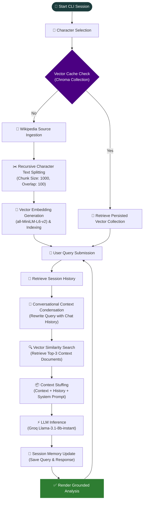

<div align="center">

# 🎭 UNMASKED

**Know the character. Unmask their mind.**

A conversational RAG application for exploring the psychology of fictional characters —  grounded, context-aware, and hallucination-free.

[](https://www.python.org/)
[](https://www.langchain.com/)
[](https://groq.com/)
[](https://www.trychroma.com/)
[](#license)


</div>

---

## Overview

Every great character hides something beneath the surface.

> Batman isn't just a vigilante. Johan Liebert isn't just a villain. Walter White isn't just a chemistry teacher.

**UNMASKED** is a Retrieval-Augmented Generation (RAG) application that lets you have natural, multi-turn conversations about fictional characters. Instead of relying on an LLM's internal (and often hallucinated) knowledge, every response is grounded in retrieved facts from a dedicated per-character knowledge base.

It doesn't roleplay as the character — **it helps you analyze them.**

```
Who is Batman?
Why does he refuse to kill?
What shaped his moral code?
Was he always this way?
How did his parents' death shape his identity?
```

A history-aware retrieval pipeline rewrites ambiguous follow-ups ("him", "that", "why") into standalone search queries, so conversations stay natural without repeating the character's name every turn.

<table>
<tr>
<td width="33%" valign="top">

**🧠 Grounded, not generic**
Every answer is backed by retrieved source chunks — not model hallucination.

</td>
<td width="33%" valign="top">

**💬 Multi-turn memory**
Follow-up questions resolve pronouns and context automatically.

</td>
<td width="33%" valign="top">

**⚡ Fast inference**
Powered by Groq's Llama 3.1 8B Instant for near-instant responses.

</td>
</tr>
</table>

---

## Demo

```text
$ python main.py

  UNMASKED
  Know the character. Unmask their mind.

 ─────────────────────────────────────────────

  Enter a character name to begin.
  Try: Batman · Walter White · Johan Liebert

  character › Batman

  ✓ Batman · indexed
  Ask anything about the character.  q to quit.

 ─────────────────────────────────────────────

  › Who is Batman?

  UNMASKED
  Batman is the alias of Bruce Wayne, a wealthy American playboy and
  industrialist. He is a vigilante driven by witnessing his parents'
  murder as a child — vowing to never kill, and to protect Gotham City
  from the evil that took everything from him.

 ─────────────────────────────────────────────

  › Why does he refuse to kill?

  UNMASKED
  Taking a life would make him indistinguishable from the criminals he
  fights. The no-kill rule is the one line he refuses to cross — the
  last thing separating his grief-driven mission from becoming the
  very thing he hunts.

 ─────────────────────────────────────────────

  › q
  Session ended.
```

"He", "that", and "his" all resolve correctly across turns — no context is lost, and no character name needs repeating.

---

## System Architecture & Flow

UNMASKED is built on a modular, decoupled architecture consisting of four core components:
1. **Interactive CLI Frontend** (`main.py`): Manages user input/output, formatting (via `rich`), and session lifetime.
2. **Chain Orchestrator** (`chain.py`): Assembles the LangChain pipelines and handles cache checks.
3. **Ingestion & Retrieval Pipeline** (`chain.py` + `prompts.py`): Performs Wikipedia scraping, text chunking, HuggingFace local embedding generation, and Chroma DB semantic search.
4. **LLM & Memory Provider** (`chain.py` + `memory.py`): Manages Llama 3.1 inference via Groq, coordinates conversational context rewriting, and retains session chat history.

---

### Core End-to-End RAG Lifecycle

The flowchart below traces the complete lifecycle of a user session—from character loading/ingestion through conversational query resolution.



**Why the rewrite step matters:**

| Without rewriting | With history-aware rewriting |
|---|---|
| `"What about his childhood?"` → searches `"childhood"` (too vague) | `"What about his childhood?"` → rewritten to `"What was Batman's childhood like?"` |
| Retrieval misses relevant chunks | Retrieval is precise and grounded |

---

## Project Structure

```
unmasked/
├── main.py           # CLI entry point — banner, character load, chat loop
├── chain.py           # build_chain(character) — ingestion, pipeline assembly
├── prompts.py          # ChatPromptTemplate definitions — UNMASKED persona
├── memory.py           # Session store — InMemoryChatMessageHistory
├── Chroma_DB/           # Persisted vector collections, one per character
├── .env                  # GROQ_API and HF_TOKEN
└── requirements.txt
```

> **One file, one responsibility.** `chain.py` never touches CLI logic. `main.py` never touches embedding logic — making a future API version a drop-in swap of only `main.py`.

---

## Memory Model

Session history lives in memory for the lifetime of the running process:

```python
store = {}

def get_session_history(session_id):
    if session_id not in store:
        store[session_id] = InMemoryChatMessageHistory()
    return store[session_id]
```

| Event | History State |
|---|---|
| Chatting within one CLI run | ✅ Persists — every prior message remembered |
| Typing `quit` | ❌ Cleared — process exits, dict is gone |
| Running `python main.py` again | 🔄 Fresh start, empty store |

> The **ChromaDB vector store** persists across runs regardless — once a character is scraped and embedded, reloading is instant on future runs.

---

## Tech Stack

| Layer | Tool | Purpose |
|---|---|---|
| Language | Python | Core application |
| Orchestration | LangChain | Chain composition, RAG pipeline |
| LLM Provider | Groq | Fast inference |
| Model | Llama 3.1 8B Instant | Response generation |
| Vector Store | ChromaDB | Embedding storage + similarity search |
| Embeddings | HuggingFace `all-MiniLM-L6-v2` | Local, free, 384-dim vectors |
| Data Source | Wikipedia Loader | Character source material |
| Memory | In-memory dict + `InMemoryChatMessageHistory` | Session-scoped conversation memory |
| CLI | Rich | Terminal UI |

### LangChain Concepts Used

| Concept | Role in UNMASKED |
|---|---|
| `ChatPromptTemplate` | Defines the UNMASKED persona and structures system / history / human messages |
| `MessagesPlaceholder` | Injects variable-length chat history into the prompt |
| `create_stuff_documents_chain` | Stuffs retrieved chunks into `{context}` before generation |
| `create_retrieval_chain` | Combines retriever + document chain into one callable pipeline |
| `create_history_aware_retriever` | Rewrites follow-up questions into standalone queries before retrieval |
| `RunnableWithMessageHistory` | Adds multi-turn session memory to an otherwise stateless chain |

---

## Setup

```bash
git clone <repo>
cd unmasked

python -m venv venv
source venv/bin/activate      # Windows: venv\Scripts\activate

pip install -r requirements.txt
```

Add your API keys to a `.env` file:

```env
GROQ_API=your_groq_key_here
HF_TOKEN=your_huggingface_token_here
```

---

## Usage

```bash
python main.py
```

Enter any fictional character at the prompt. UNMASKED scrapes and indexes Wikipedia on first load, then caches it for future runs.

| Input | Action |
|---|---|
| Any question | Grounded psychological analysis |
| `quit` / `exit` / `q` | End the session |
| `Ctrl+C` | Exit immediately |

---

<div align="center">

*Every character wears a mask. UNMASKED helps you understand what's underneath.*

</div>
