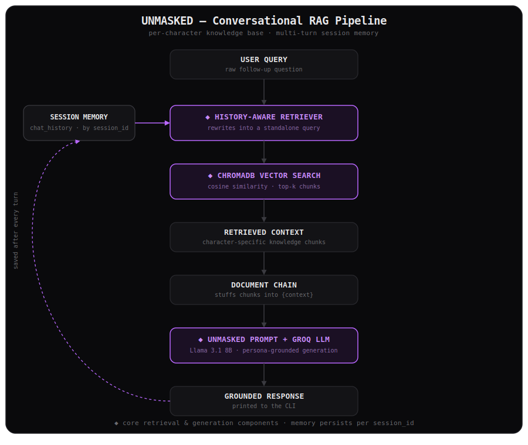

<div align="center">

# 🎭 UNMASKED

**AI-powered conversational RAG for analyzing fictional characters through grounded psychological conversations.**

*Know the character. Unmask their mind.*


**[Overview](#overview) · [Demo](#demo) · [Architecture](#architecture) · [Setup](#setup) · [Usage](#usage) · [Tech Stack](#tech-stack)**

</div>

<br>

## Overview

Every great character hides something beneath the surface.

Batman isn't just a vigilante. Johan Liebert isn't just a villain. Walter White isn't just a chemistry teacher. Ask a generic LLM about any of them and you get plot summary — surface facts, no depth, occasionally invented.

UNMASKED is built differently. It's a Retrieval-Augmented Generation application that holds real, multi-turn conversations about a character's psychology — motivation, trauma, defense mechanisms, moral logic — with every claim grounded in retrieved source material for that specific character.

**It doesn't roleplay as the character. It helps you analyze them.**

```
Who is Batman?
Why does he refuse to kill?
What shaped his moral code?
Was he always this way?
```

A history-aware retrieval pipeline rewrites ambiguous follow-ups — "him", "that", "why" — into standalone search queries, so the conversation stays natural without repeating the character's name every turn.

<br>

## Demo



"He", "that", and "his" all resolve correctly across turns — no context lost, no name repetition needed.

<br>

## Architecture



UNMASKED is built on four decoupled components, each with exactly one job:

| Component | File | Responsibility |
|---|---|---|
| CLI Frontend | `main.py` | Input/output, formatting, session lifecycle — zero LangChain internals |
| Chain Orchestrator | `chain.py` | Assembles the RAG pipeline, handles per-character cache checks |
| Ingestion & Retrieval | `chain.py` / `prompts.py` | Wikipedia scraping, chunking, embedding, ChromaDB similarity search |
| LLM & Memory | `chain.py` / `memory.py` | Groq inference, history-aware rewriting, session-scoped chat history |

**Why the rewrite step matters:**

| Without rewriting | With history-aware rewriting |
|---|---|
| "What about his childhood?" → searches literally for *"his childhood"* | Rewritten to *"What was Batman's childhood like?"* before searching |
| Retrieval is vague, often misses the right chunks | Retrieval is precise and grounded every time |

### RAG Pipeline Configurations

| Stage | Component / Model | Configuration / Value |
|---|---|---|
| **Data Ingestion** | WikipediaLoader | Fetches up to 2 Wikipedia articles per character with custom User-Agent |
| **Text Chunking** | RecursiveCharacterTextSplitter | Chunk size: `1000` characters, chunk overlap: `100` characters |
| **Embeddings** | HuggingFace `all-MiniLM-L6-v2` | Local execution (CPU), 384-dimensional vectors, L2 normalized |
| **Vector Store** | ChromaDB (PersistentClient) | Dynamic database cache, segregated collection per character |
| **Retrieval** | Similarity Search | Top-3 semantic chunks retrieved ($k=3$) |
| **LLM Provider** | ChatGroq (`llama-3.1-8b-instant`) | `temperature=0.1`, `max_tokens=512`, timeout: 30s |

### Design Decisions & Rationales

* **Why Wikipedia?** Wikipedia provides a structured, factual, and neutral source of narrative summaries. It avoids noisy, colloquial forum data, ensuring that the character's psychological profile starts with high-quality source text. The ingestion pipeline is source-agnostic, meaning you can easily swap this loader for a custom PDF, fandom wiki, or database loader.
* **Why ChromaDB?** A local, embedded database avoids the overhead of managing a network-based vector database service (like Pinecone or Milvus) and makes local setup instant and serverless.
* **Why per-character vector collections?** Instead of storing all characters in one large namespace, UNMASKED isolates each character into a dedicated ChromaDB collection (e.g., `batman_db`). This guarantees zero context leakage across different character sessions, makes database cleaning simple, and speeds up queries.
* **Why history-aware retrieval?** User inputs in a chat are conversational and use anaphora (e.g., "why does he refuse to kill?"). If queried directly against the vector database, these terms retrieve irrelevant records. History-aware retrieval uses the LLM to rewrite ambiguous user queries into standalone, search-optimized queries before querying ChromaDB.
* **Why session-scoped memory?** Ephemeral memory (`InMemoryChatMessageHistory`) ensures that chat context doesn't drift between character switches or across separate application runs, while keeping the persistent vector store clean and specialized.

<br>

## Project Structure

```
unmasked/
├── main.py           # CLI entry point — banner, character load, chat loop
├── chain.py           # build_chain(character) — ingestion, pipeline assembly
├── prompts.py          # ChatPromptTemplate definitions — UNMASKED persona
├── memory.py           # Session store — InMemoryChatMessageHistory
├── Docs/
│   ├── Demo.png
│   └── architecture.svg
├── Chroma_DB/            # Persisted vector collections, one per character
├── .env                    # GROQ_API and HF_TOKEN
└── requirements.txt
```

One file, one responsibility. `chain.py` never touches CLI logic. `main.py` never touches embedding logic — which means a future API version is a drop-in swap of `main.py` alone.

<br>

## Memory Model

Session history lives in memory for the lifetime of the running process:

```python
store = {}

def get_session_history(session_id):
    if session_id not in store:
        store[session_id] = InMemoryChatMessageHistory()
    return store[session_id]
```

| Event | History state |
|---|---|
| Chatting within one CLI run | Persists — every prior message remembered |
| Switching character with `new` | Fresh session, previous history left behind |
| Typing `q` / `quit` / `exit` | Cleared — process exits, dict is gone |
| Running `python main.py` again | Fresh start, empty store |

The ChromaDB vector store is the exception — it persists across runs regardless of session memory. Once a character is scraped and embedded, reloading it on a future run is instant.

<br>

## Tech Stack

| Layer | Tool | Purpose |
|---|---|---|
| Language | Python | Core application |
| Orchestration | LangChain | Chain composition, RAG pipeline |
| LLM Provider | Groq | Fast inference |
| Model | Llama 3.1 8B Instant | Response generation |
| Vector Store | ChromaDB | Embedding storage + similarity search |
| Embeddings | HuggingFace `all-MiniLM-L6-v2` | Local, free, 384-dim vectors |
| Data Source | Wikipedia Loader | Character source material |
| Memory | In-memory dict + `InMemoryChatMessageHistory` | Session-scoped conversation memory |
| CLI | Rich | Terminal UI, live status, markdown rendering |

<br>

## LangChain Concepts

| Concept | Role in UNMASKED |
|---|---|
| `ChatPromptTemplate` | Defines the UNMASKED persona, structures system / history / human messages |
| `MessagesPlaceholder` | Injects variable-length chat history into the prompt |
| `create_stuff_documents_chain` | Stuffs retrieved chunks into `{context}` before generation |
| `create_retrieval_chain` | Combines retriever + document chain into one callable pipeline |
| `create_history_aware_retriever` | Rewrites follow-up questions into standalone queries before retrieval |
| `RunnableWithMessageHistory` | Adds multi-turn session memory to an otherwise stateless chain |

<br>

## Setup

Follow these steps to set up UNMASKED locally on your machine.

### 📋 Prerequisites

Before you start, make sure you have the following installed:
* **Python 3.10 or higher**: Check your version using `python --version` (or `python3 --version`).
* **Git**: To clone the repository.
* **Groq API Key**: Needed to run inference via Llama 3.1. Get one for free at the [Groq Console](https://console.groq.com/).
* **Hugging Face Account** (Optional): Useful if you want to use customized models or avoid rate limits. Get a token at [Hugging Face Settings](https://huggingface.co/settings/tokens).

---

### 🚀 Step-by-Step Installation

#### 1. Clone the Repository
Clone the codebase and navigate to the project root directory:
```bash
git clone https://github.com/itslokeshx/Unmasked.git
cd Unmasked
```

#### 2. Set Up a Virtual Environment
We recommend using a virtual environment to keep your global Python environment clean and avoid dependency conflicts:
* **macOS / Linux**:
  ```bash
  python3 -m venv venv
  source venv/bin/activate
  ```
* **Windows (Command Prompt)**:
  ```cmd
  python -m venv venv
  venv\Scripts\activate
  ```
* **Windows (PowerShell)**:
  ```powershell
  python -m venv venv
  .\venv\Scripts\Activate.ps1
  ```

#### 3. Install Dependencies
Upgrade `pip` first, then install the required Python packages:
```bash
pip install --upgrade pip
pip install -r requirements.txt
```
> **Note:** Installing `chromadb` and `sentence-transformers` may compile native components or download package dependencies. Please ensure you have basic C++ build tools installed on your system if compilation errors occur.

#### 4. Configure Environment Variables
Copy the template `.env.example` file to create your `.env` configuration:
```bash
cp .env.example .env
```
Open the newly created `.env` file and replace the placeholders with your actual keys:
```env
GROQ_API=gsk_your_groq_api_key_here
HF_TOKEN=hf_your_huggingface_token_here
```

#### 5. Run the Application
Start the interactive CLI application:
```bash
python main.py
```

---

### 📦 First-Run & Caching Behavior

When you start the application for the first time:
1. **Model Download:** The application will download the Hugging Face `all-MiniLM-L6-v2` embedding model (approximately 90MB) to compute vectors locally on your CPU. This happens automatically and only once.
2. **Scraping & Indexing:** When you enter a character (e.g., *Batman*), UNMASKED queries Wikipedia, splits the pages into chunks, generates embeddings, and saves the vectors in the local `/Chroma_DB` directory.
3. **Subsequent Runs:** For any character that has been indexed before, UNMASKED reads directly from `/Chroma_DB`, avoiding Wikipedia scrapes and redundant embedding generation. Startups for cached characters are instant.

---

### 🛠️ Troubleshooting

* **SSL/TLS Certificate Errors (macOS):**
  If Python fails to download the embedding model or fetch Wikipedia due to SSL errors, run the certificate installation script shipped with Python on macOS:
  ```bash
  /Applications/Python\ 3.xx/Install\ Certificates.command
  ```
* **ChromaDB Installation Fails:**
  ChromaDB requires C++ compilation on some platforms. 
  - **Windows:** Install [Visual Studio Build Tools](https://visualstudio.microsoft.com/visual-cpp-build-tools/) and select "Desktop development with C++".
  - **Linux (Ubuntu/Debian):** Run `sudo apt-get install build-essential python3-dev`.
* **Groq Authentication Errors:**
  Ensure the `GROQ_API` value in `.env` is exact, has no leading/trailing quotes, and begins with `gsk_`.

<br>

## Usage

```bash
python main.py
```

Enter any fictional character at the prompt. UNMASKED scrapes and indexes Wikipedia on first load, then caches it for every run after.

| Input | Action |
|---|---|
| Any question | Grounded psychological analysis |
| `new` | Unmask a different character, mid-session |
| `help` | Show available commands |
| `q` / `quit` / `exit` | End the session |
| `Ctrl+C` | Exit immediately |

<br>

## Current Limitations & Roadmap

### Limitations
* **Single-Source Ingestion:** Relies solely on Wikipedia, which may omit deep comic-book issues or fan theories.
* **Volatile Session Memory:** Chat history is stored in-memory and cleared on application exit or character switch.
* **Single-Character Scope:** Multi-character debates or joint analyses are not supported in the current pipeline.
* **No Reranking Step:** Semantic search retrieves directly from vector distance, without cross-encoder reranking.

### Roadmap
1. **Multi-Source Ingestion:** Integrate Fandom Wikia, custom books, and PDF character guides.
2. **Persistent Chat Sessions:** Implement SQLite or file-based memory to save and resume character chats.
3. **Cross-Character Analysis:** Allow loading two characters in a dual-retriever pipeline for comparative psychology.
4. **Context Reranking:** Integrate a local or API-based cross-encoder (e.g., Cohere or HuggingFace) to improve retrieval precision.

<br>

---

<div align="center">

*Every character wears a mask. UNMASKED helps you understand what's underneath.*

</div>